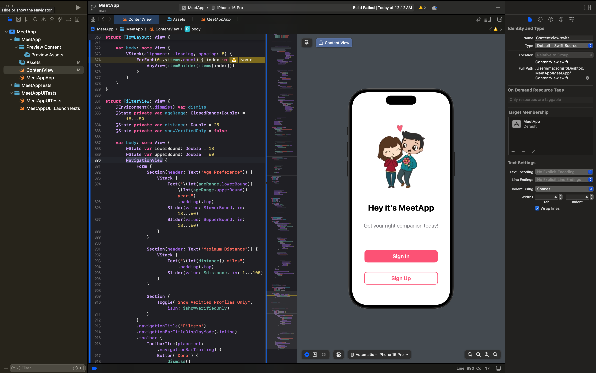
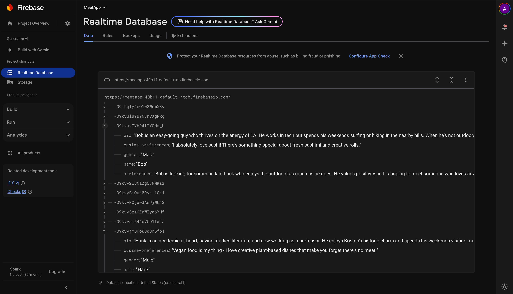
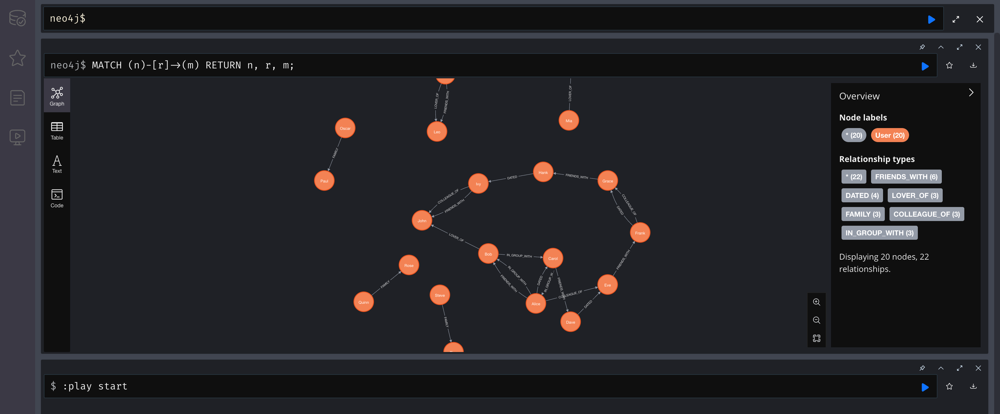
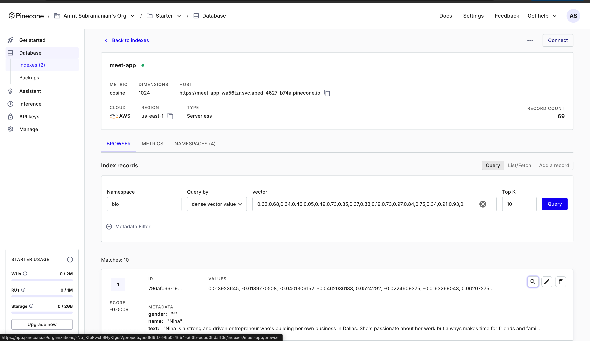
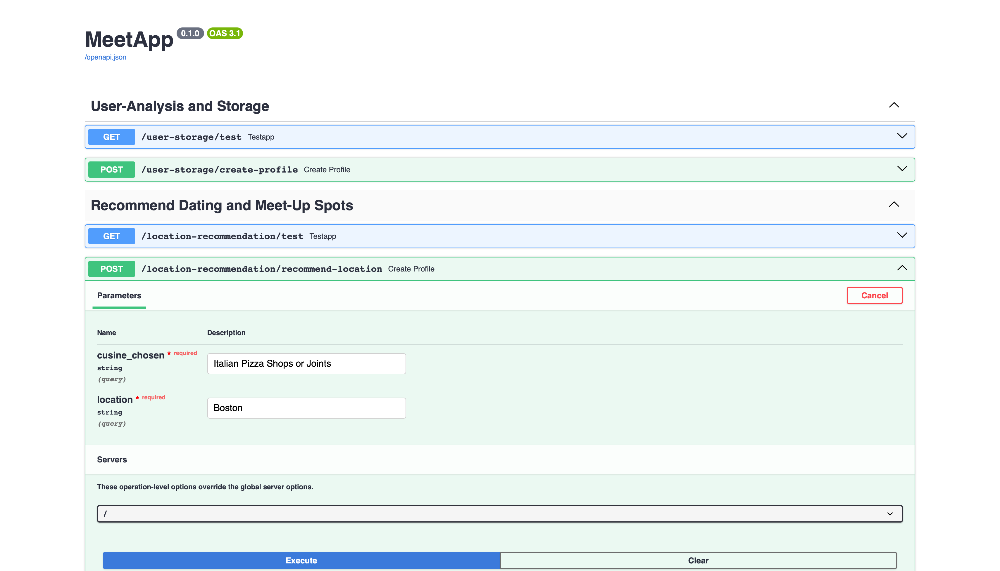
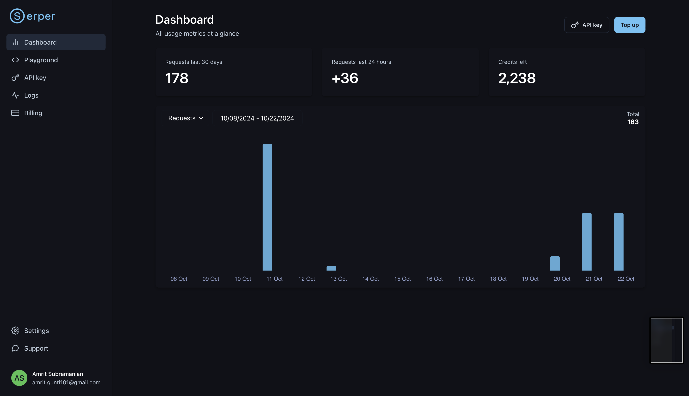
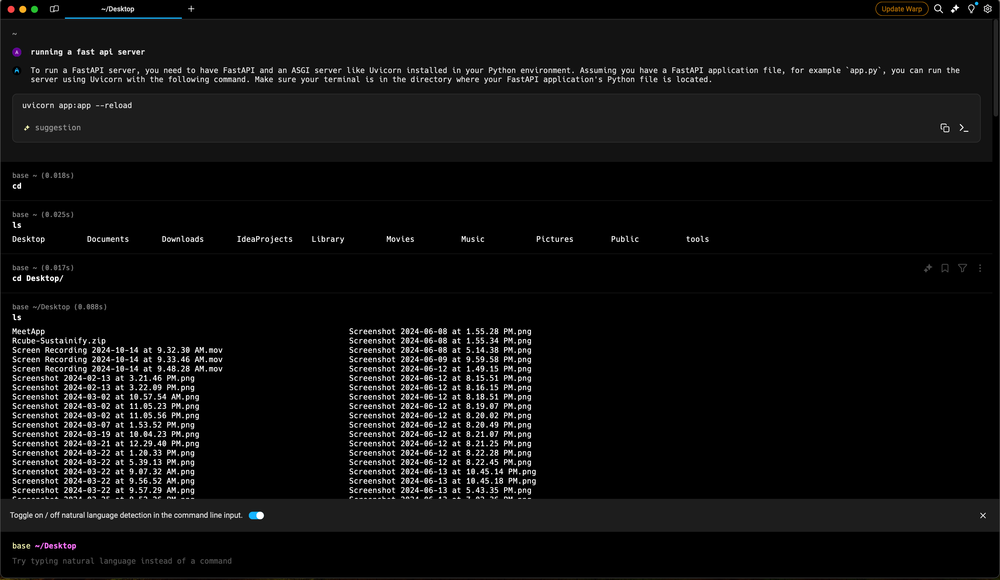

# MeetApp

### **Find and Connect with Like-Minded People!**

MeetApp is an innovative platform that helps people find each other and socialize, based on shared interests and preferences. Whether you're looking for a casual meetup, a new friend, or someone with similar dining preferences, MeetApp has you covered.

---

## 🚀 **Project Overview**

MeetApp uses advanced matching algorithms to pair users based on their bios, partner preferences, and cuisine preferences. Our unique scoring system combines multiple similarity scores into a single composite score using an **ensemble evaluation mechanism**. This ensures that our recommendations are not only accurate but also tailored to each user's personality and preferences.

The primary features include:
- **User Profiles**: Users can create detailed bios, set their preferences for partners, and indicate their favorite cuisines.
- **Advanced Matching Algorithm**: MeetApp leverages a sophisticated ensemble scoring technique, combining various metrics into a weighted average for better matching.
- **Socializing and Meetups**: Once matched, users can initiate conversations, plan meetups, and build lasting relationships.

---

## 🧠 **Key Features**

- **Bio & Preferences**: Users provide detailed personal information and preferences to tailor their match suggestions.
- **Cuisine Preferences**: Filter and match people who share your culinary tastes.
- **Ensemble Scoring**: Uses multiple algorithms and weighted averages to offer the best matches.
- **Real-Time Interaction**: Chat and meet up with people through the app.

---

## 🔧 **Technologies Used**

MeetApp is built using cutting-edge technologies for performance, scalability, and accuracy:

- **[SerperAI](https://serper.dev/)**: Provides advanced AI features for processing and evaluating user preferences.
- **[FastAPI](https://fastapi.tiangolo.com/)**: A high-performance API framework for powering the backend and matchmaking services.
- **[Swift](https://developer.apple.com/swift/)**: The core language for developing the iOS mobile application.
- **[Pinecone](https://www.pinecone.io/)**: For vector database services, enabling efficient search and similarity comparisons.
- **[Firebase](https://firebase.google.com/)**: Manages authentication, real-time database features, and hosting.
- **[Gemini-1.5-pro](https://example.com)**: An advanced AI model that assists in the recommendation system.
- **[Neo4k][https://neo4j.com]**: A Graph Based DB for storing entries and nodes and relationships.
---

## 📈 **How Matching Works**

Our matching algorithm evaluates users' preferences based on:

1. **Bio Similarity**: Matching users with similar life goals, hobbies, and interests.
2. **Partner Preferences**: Ensuring users meet the criteria they set for their ideal partner.
3. **Cuisine Preferences**: Matching users based on shared favorite cuisines.
4. **Ensemble Scoring**: We use a combination of various matching models, weighted together, to generate a single match score.

This unique combination ensures that users receive the best possible matches, with recommendations fine-tuned over time based on feedback and usage patterns.

---

## 🛠️ **Xcode IDE and SwiftUI**

---

## 🛠️ **FireBase Realtime DB and Storage Bucket**

---

## 🛠️ **Neo4j Graph Structured-DB**

---

## 🛠️ **PineCone Vector-DB**

---

## 🛠️ **FastAPI - Backend API Rollouts**

---

## 🛠️ **SerperAI - Realtime Location Crawler**

---

## 🛠️ **Warp - An AI Powered Terminal was used in development**

